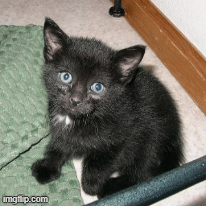
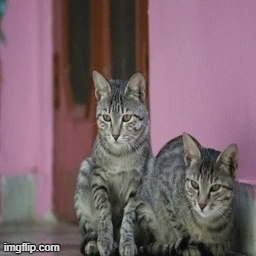

# Image Tampering Localization

Finding if an image is tampered and if tampered, the tampered section is localized. :sunglasses: :sunglasses:<br>
Model is trained on Cat-Dog Images, which are tampered automatically using the dodge function. <br>

## Requirements
* torch >= 1.1.0 <br>
* torchvision >= 0.3.0 <br>
* opencv>= 4.2.0 <br>
* PIL >= 7.2.0 <br>

## Steps To Run

### 1. Data Process
```.bash
python data_process.py
```
Creates two h5py files (This is for classification process), one for training and the other for validation. <br> <br>
<b>Note: </b> <br>
In data_process.py, 12000 cat images are taken and tampered. The process of Dodging is used for manipulation, though it can be extended to other processes as well. Different parts of the images are tampered. The size of the training data becomes 24000. <br>
Then, both the tampered and Normal images are saved, along with the appropriate labels in a h5py file. This is repeated for validation dataset. <br>

```.bash
python data_process_unet.py
```
Creates two h5py files (This is for localization process), one for training and the other for validation. <br> <br>
<b>Note:</b> <br>
1000 cat images are taken and tampered (dodging). The tampered images with the corresponding masks are stored in the h5py files. <br> <br>

### 2. Training The Models
```.bash
python train.py
```
<b>Note:</b><br>
This loads the dataset and trains the classification model and saves the checkpoint. I have already trained the model for a few epochs. <br> <br>

```.bash
python train_unet.py
```
<b>Note:</b><br>
This loads the dataset and trains the localization model (UNet) and saves the checkpoint. I have already trained the model for a few epochs.

## Additional Notes:
   If you wish to train further, please change the "epochs" variable in train.py and train_unet.py and run it. Validation accuracy is also calculated using the validation data. Validation accuracy for the classification model is 90%.(500 Normal Images and 500 Manipulated Images)
   I have also added a test file to test any image. Run "python test.py" to test using default parameters. Run "python test.py --help" to see customizable parameters. As of now, checkpoint of classifer, checkpoint of localizer, image, tamper (True/False) and side of tampering are customizable.
```.bash
python test.py --help
```
## Results
### Manipulated Image

### Normal Image


Different types of Image tampering processes can be added and trained. :wink:<br>
Go ahead..pull it, train it and have fun. :smile:

-------------------------------------
<p align="center">
:star: Happiness should be a function without any parameters :star: <br> <br>
<b>Happy Coding</b> :exclamation: :exclamation:
</p>
